# Actividad 2

Esta segunda actividad consiste en clonar un *depot* de *Perforce* y utilizarlo para guardar un proyecto que deberemos crear de 0 con *Unity*.

Esta actividad consta de una serie de puntos:
1. Crear una conexión al depósito FDV2223 en la ULL.
    - El primer paso es crear un *Workspace*, o un directorio local en nuestro PC que contendrá copias locales de ficheros almacenados en el servidor de *Perforce* y con el que deberá sincronizarse. Para ello, lo primero es abrir el desplegable de *Workspaces* y seleccionar la opción de añadir uno nuevo.
    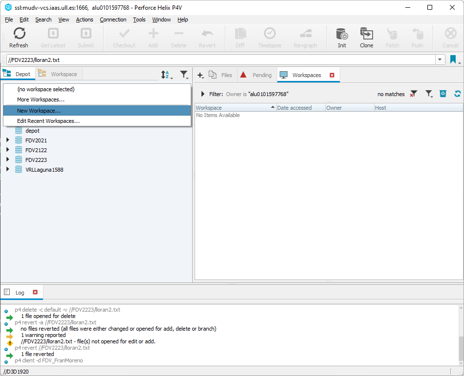
    - Esto nos abrirá una nueva ventana, en la cual deberemos especificar el nombre del *Workspace*, en qué directorio local lo almacenaremos y con qué *depots* queremos sincronizarlo. En nuestro caso solo necesitamos el llamado *FDV2223*, por lo que eliminaremos todos los demás para que no se sincronicen con nuestro *Workspace*. Al terminar pulsamos *Ok*.
    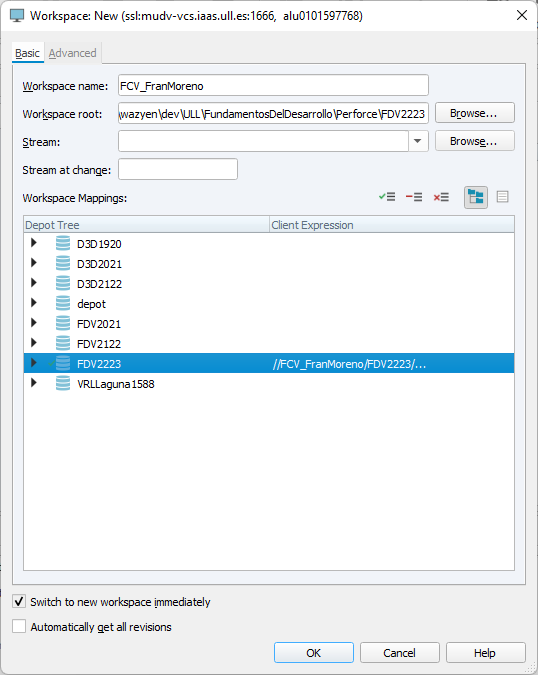
    - Si el directorio que hemos especificado no existía previamente, veremos que nos lo ha creado. Sin embargo, si nos metemos con el explorador de Windows, veremos que está vacío.
2. Clonar el repositorio.
    - Para obtener los ficheros del *depot* que hemos sincronizado, lo seleccionaremos y pulsaremos en *Refresh* (por si acaso) y luego en *Get Latest*. Con esto ya tendremos el repositorio clonado.
    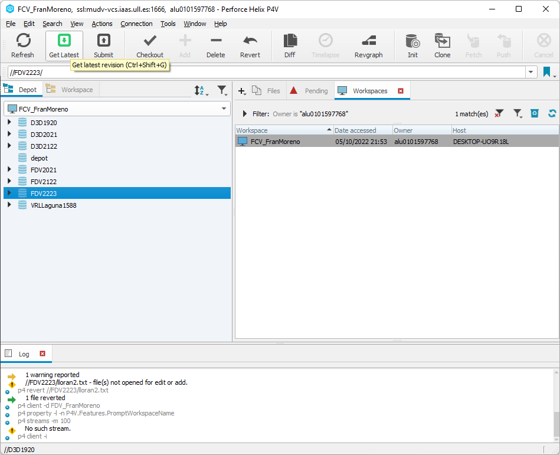
3. Modificar el fichero presentacion.txt, agregando una frase que indique tu nombre y resuma tu experiencia en la programación de videojuegos 2D y 3D.
    - La peculiaridad que tiene *Perforce* es que cada fichero no puede ser modificado simultáneamente por dos personas o más. Para ello, protegen todos los ficheros pertenecientes al servidor ante cualquier modificación haciéndolos *read-only*. Para quitar esta restricción, deberemos hacer *Check Out* de ese fichero. Esto hará que el servidor sepa que yo lo estoy modificando y no permitirá que nadie más lo modifique.
    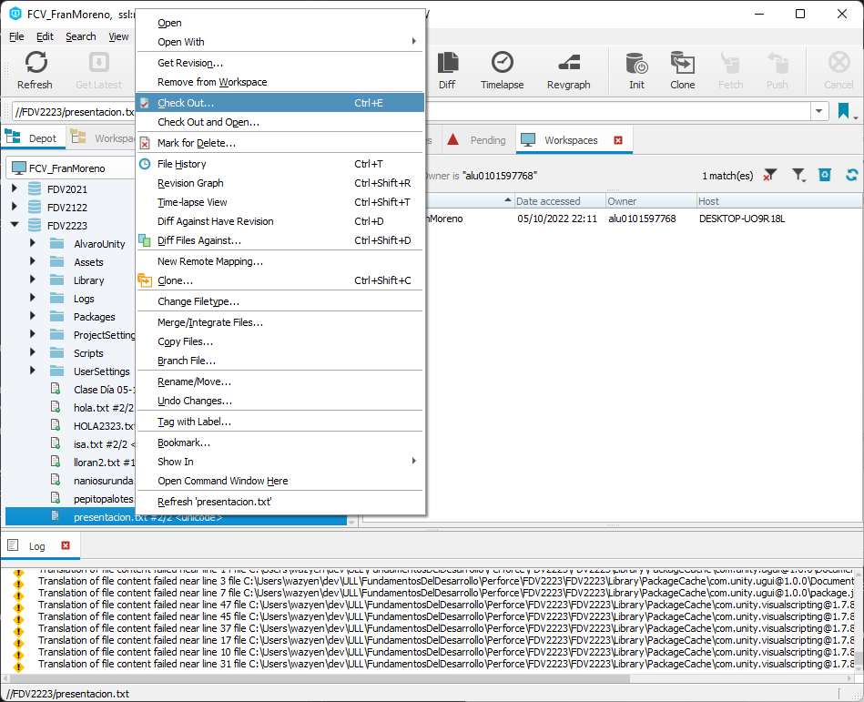
    - Se nos abrirá una nueva ventana preguntándonos a qué *Changelist* queremos asociar los datos de este fichero. De momento no nos interesa jugar con estas opciones, por lo que simplemente lo dejaremos en *default* y pulsaremos *OK*.
    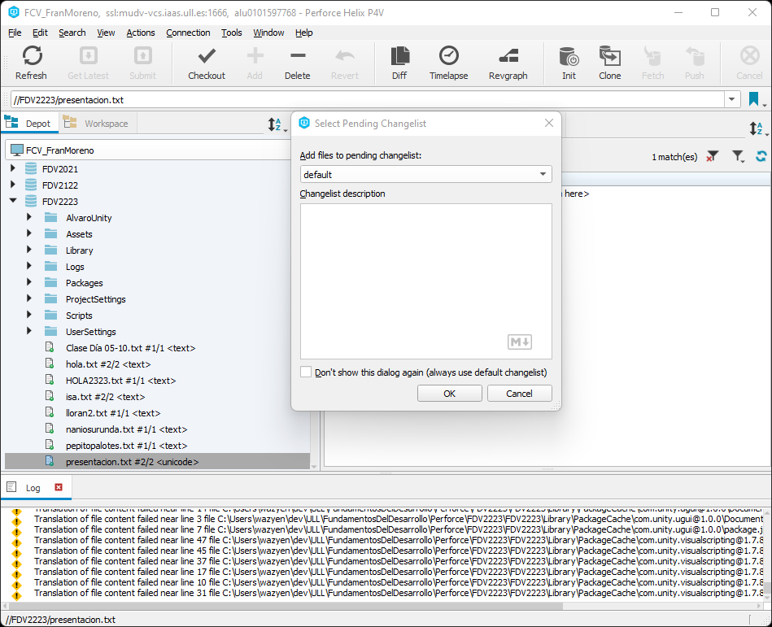
    - Si nos fijamos, en la pestaña *Pending*, donde aparecen todas nuestras *Changelists*, aparecerá el fichero que acabamos de desbloquear bajo la *Changelist* llamada *default*, pero esta vez su icono tendrá un símbolo de check de color rojo en la esquina superior izquierda, lo que significa que lo hemos reservado para poder modificarlo y ya ha dejado de ser *read-only*.
    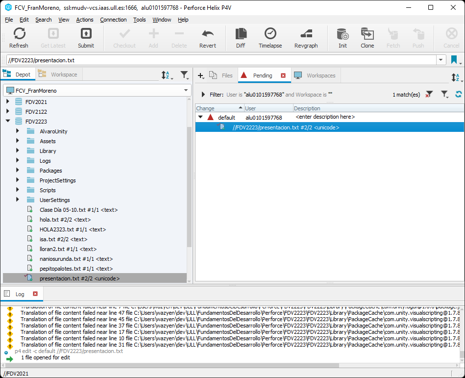
    - A continuación, simplemente podemos hacer click sobre el fichero que hemos desbloqueado desde el mismo cliente de *Perforce* y se nos abrirá (en mi caso) con el bloc de notas. Desde ahí podremos modificarlo.
    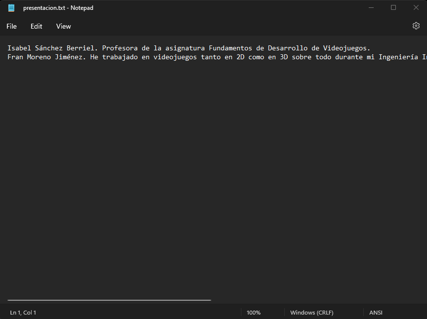
    - Ya solo falta sincronizar este cambio con el servidor. Tendremos que volver a la pestaña *Pending*, seleccionar la *Changelist* que queremos sincronizar con el servidor y pulsar *Submit*.
    
    - Ya simplemente deberemos escribir una descripción para la *Changelist* y pulsar en *Submit*. Tras esto, nuestros cambios ya estarán en el servidor de *Perforce*.
    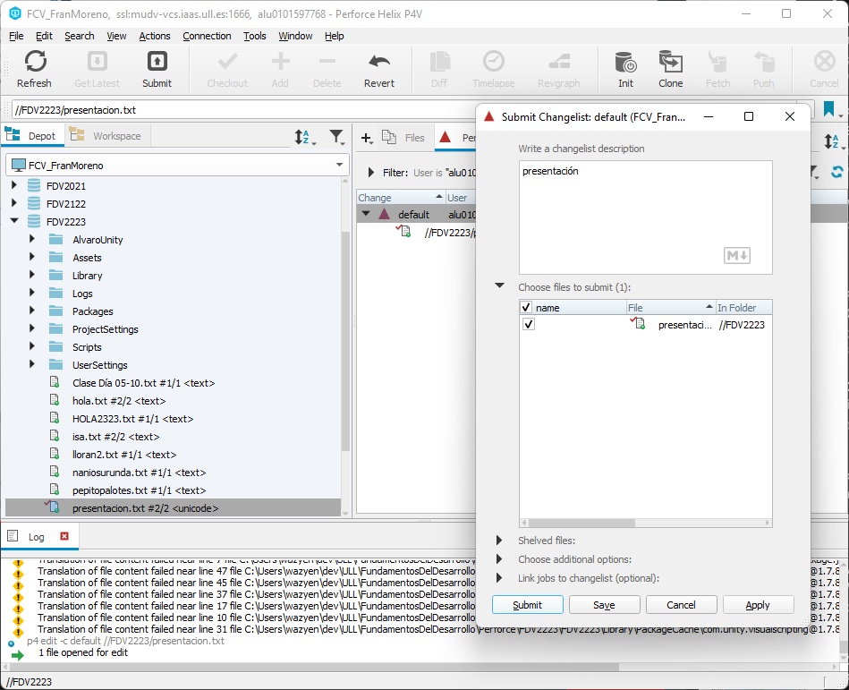
4. Crear un fichero nuevo, tu_nombre.txt y añadirlo al proyecto.
    - Deberemos crear un fichero en el directorio en el que se encuentra nuestro *Workspace*. Tras esto, veremos que este fichero figura en la pestaña *Workspace* de nuestro cliente de *Perforce*, a la izquierda, juntamente con el resto de ficheros pertenecientes al servidor. Deberemos seleccionarlo y pulsar en *Add*.
    
    - Como antes, se nos abrirá una ventana pidiendo que seleccionemos a qué *Changelist* queremos asociar la modificación.
    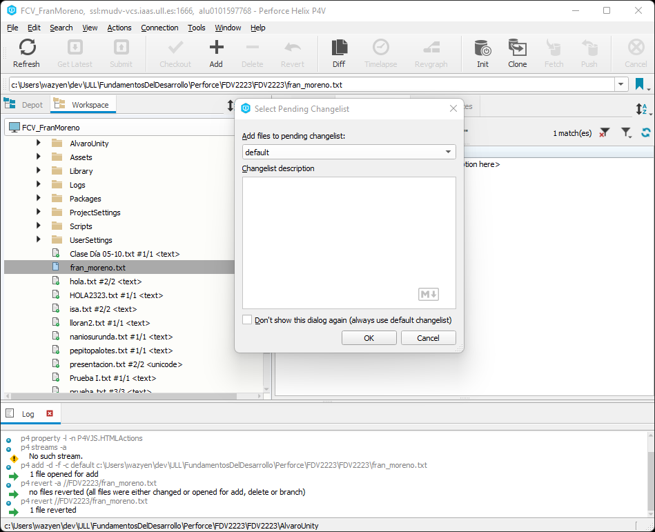
    - Esta vez veremos que el icono del fichero tiene un símbolo de suma rojo en la esquina superior izquierda. Eso significa que está listo para ser añadido al servidor publicando la *Changelist* a la cual está asociado.
    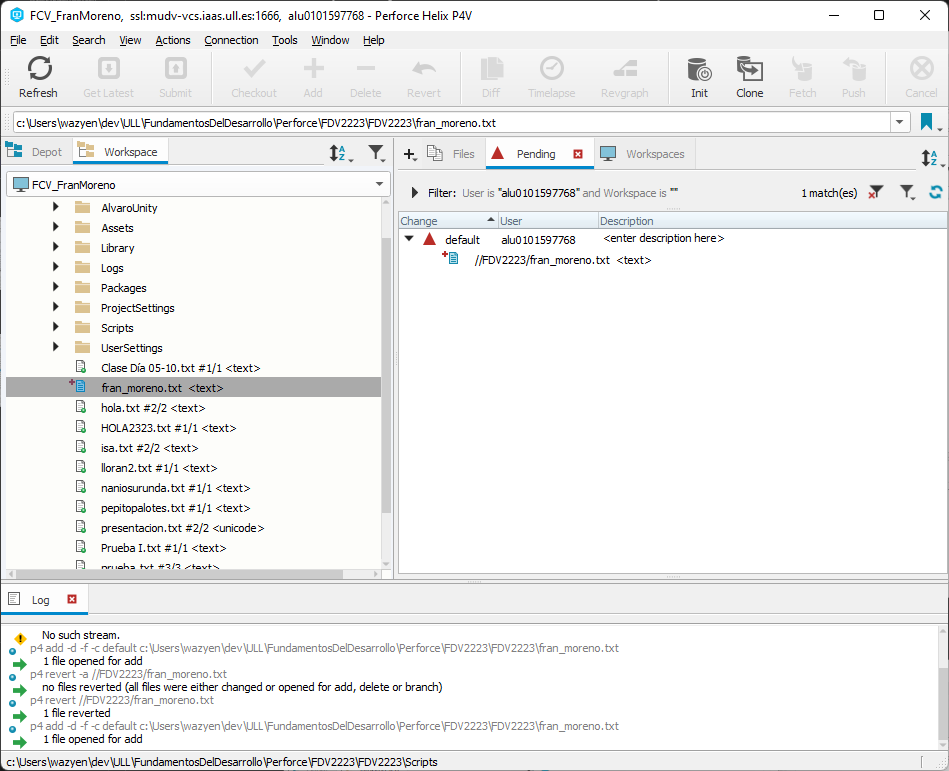
    - Como antes, seleccionamos la *Changelist* y pulsamos en *Submit*.
    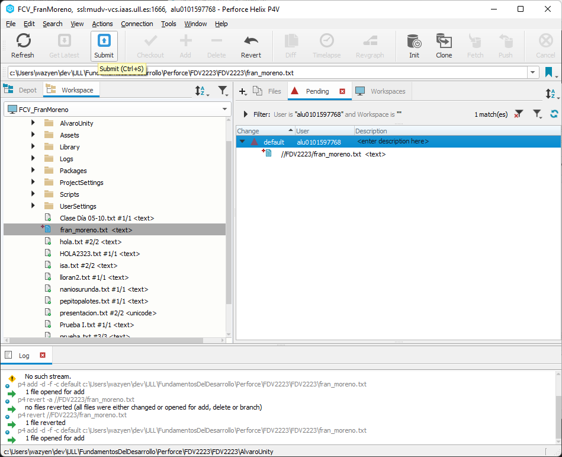
    - Como antes, escribimos una descripción para la *Changelist* y pulsamos en *Submit*. Tras esto, nuestro nuevo fichero ya estará en el servidor.
    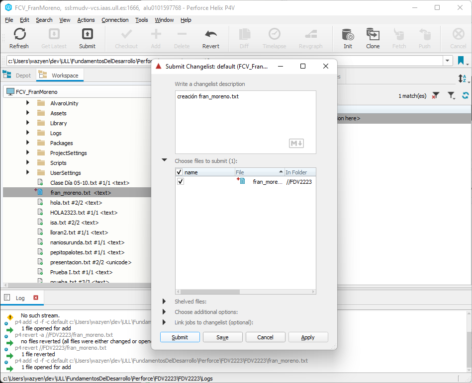
5. Crear un proyecto *Unity* y agregarlo al depot de la asignatura. Tu nombre debe ser prefijo.
    - Para ello, lo primero es ir al *Unity Hub* y asegurarnos de que nuestro PC tiene alguna instalación del editor de *Unity* en la pestaña *Installs*.
    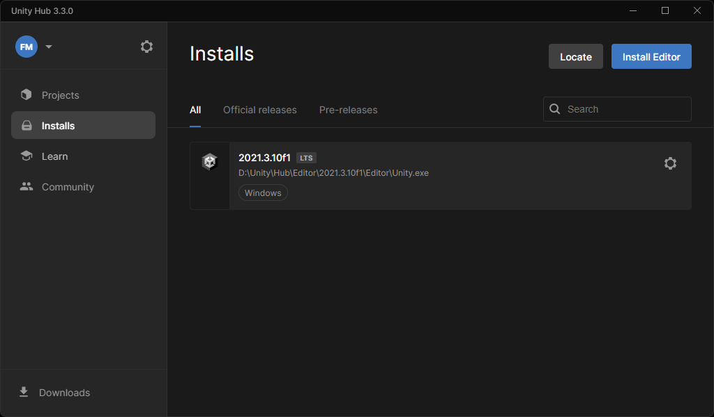
    - Ahora deberemos ir a la pestaña *Projects* y pulsar en *New project*.
    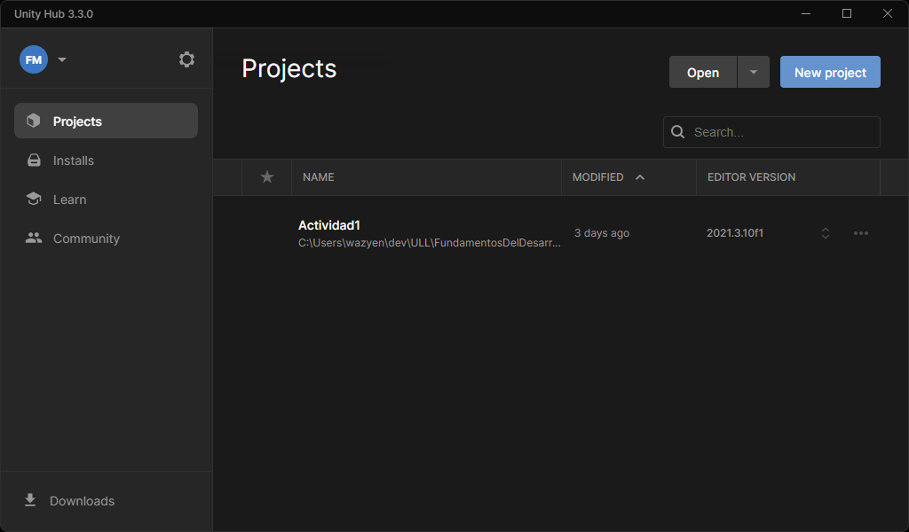
    - Se nos abrirá una pantalla de configuración inicial de proyecto. Deberemos escoger la versión del editor de *Unity* que queremos utilizar (en caso de que tengamos más de una instalada), la plantilla en la que queremos basar nuestro proyecto, el directorio donde lo queremos guardar y el nombre que le queremos dar. Una vez lo tengamos todo listo, deberemos pulsar en *Create project*.
    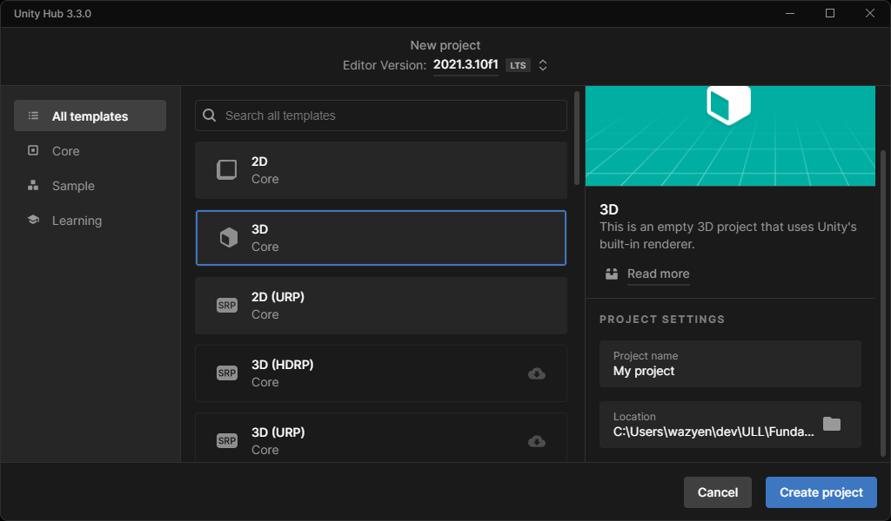
    - Tras unos segundos durante los cuales el proyecto se va a estar creando, este se nos abrirá en el editor de *Unity* en la versión que hayamos escogido.
    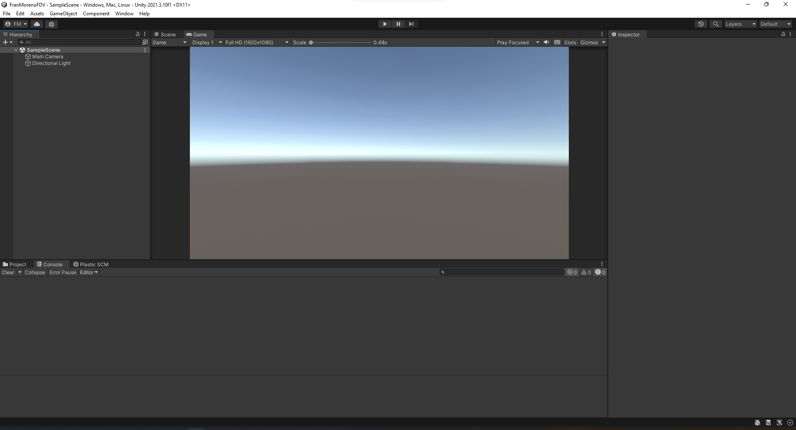
    - Ya tendremos el proyecto creado. Sin embargo, antes de subir el proyecto a la nube hay un paso que considero importante y es el de añadir un fichero que le diga a *Perforce* qué archivos debe ignorar a la hora de subir nuestros cambios locales a la nube. En nuestro caso, se tratará de ficheros temporales o de configuración que no son necesarios para que funcione el proyecto ya que se pueden generar en el momento de abrir el proyecto con *Unity*. El tema es que estos ficheros ocupan mucho espacio tontamente y por eso es mejor evitar subirlos a la nube. Con este fin, utilizaremos un fichero que llamaremos *.p4ignore* y deberá estar ubicado en la carpeta raíz de nuestro proyecto de *Unity*.
    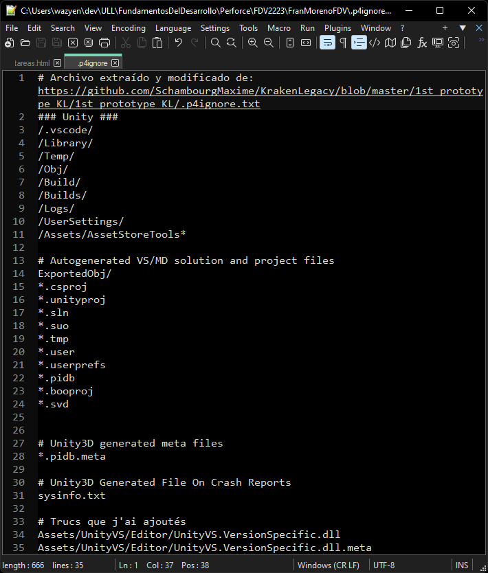
    - El cliente *P4V* debe saber de la existencia de este fichero. Para ello, haremos click derecho en la carpeta de nuestro proyecto desde la pestaña *Workspace* de *P4V* y seleccionaremos la opción *Open Command Window Here*.
    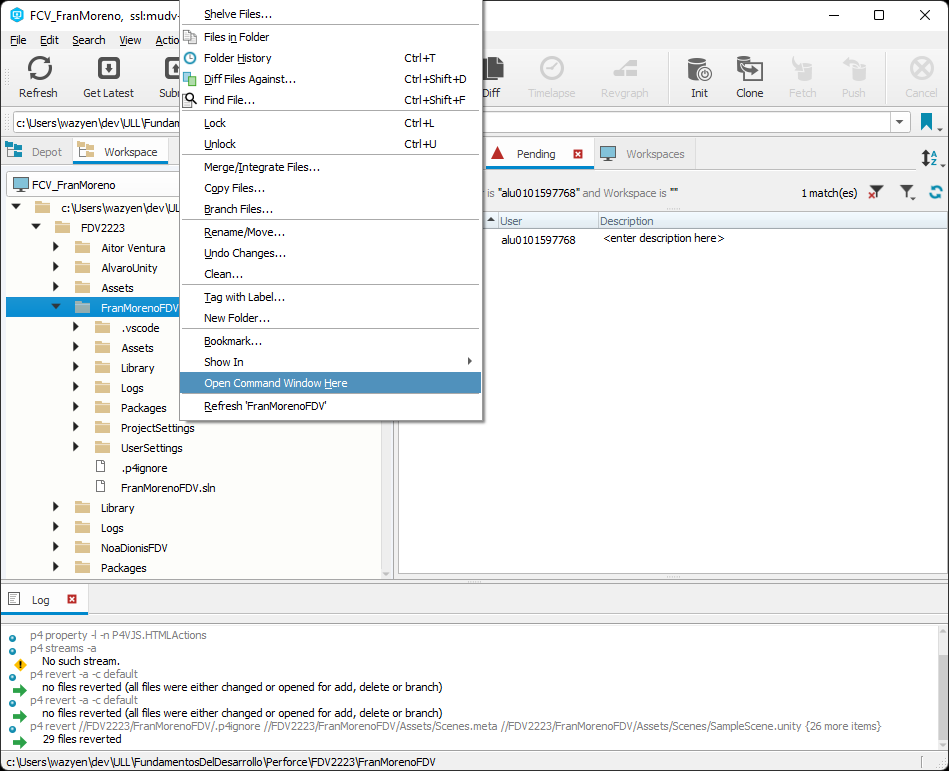
    - Una vez se nos abra la línea de comandos, introduciremos el comando `p4 set P4IGNORE=.p4ingore`, que se resolverá sin respuesta. A partir de este momento, cuando publiquemos nuestros cambios, el cliente de *Perforce* sabrá qué ficheros son los que debe ignorar.
    
    - Ahora sí, para publicar los cambios deberemos volver a *P4V* y, en la pestaña *Workspace*, seleccionar la carpeta de nuestro recientemente creado proyecto y pulsar en *Add*, tras lo cual, como antes, escogeremos la *Changelist* a la que asociar estos cambios y pulsaremos en *OK*.
    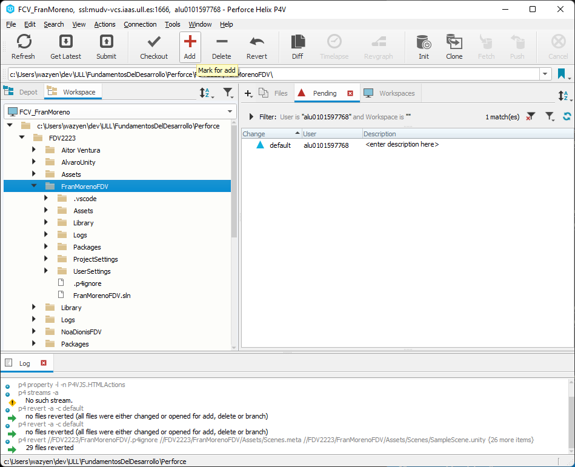
    - Aquí viene el momento de la magia. Tras hacerlo, se nos abrirá un mensaje donde se nos informará de que los ficheros especificados en el *.p4ignore* han sido ignorados. Gracias a esto podremos subir el proyecto limpio a la nube.
    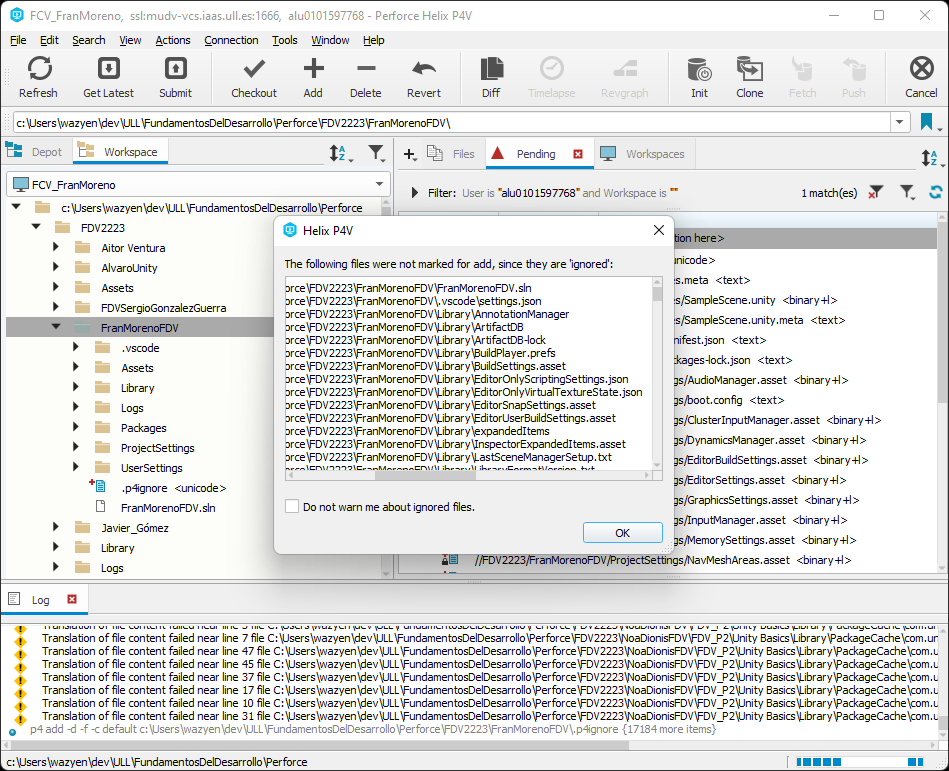
    - Listo, ya solo nos queda seleccionar la *Changelist* que queremos publicar y pulsar en *Submit*.
    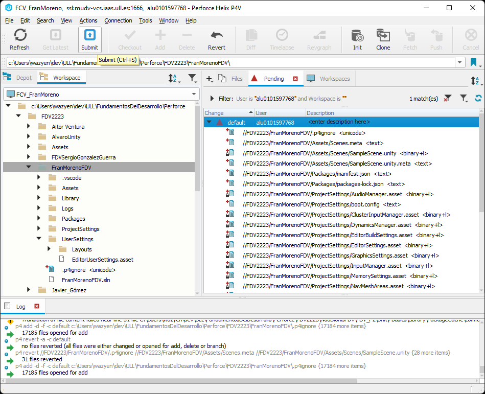
    - De nuevo, escribimos una descripción para la *Changelist* y pulsamos en *Submit*.
    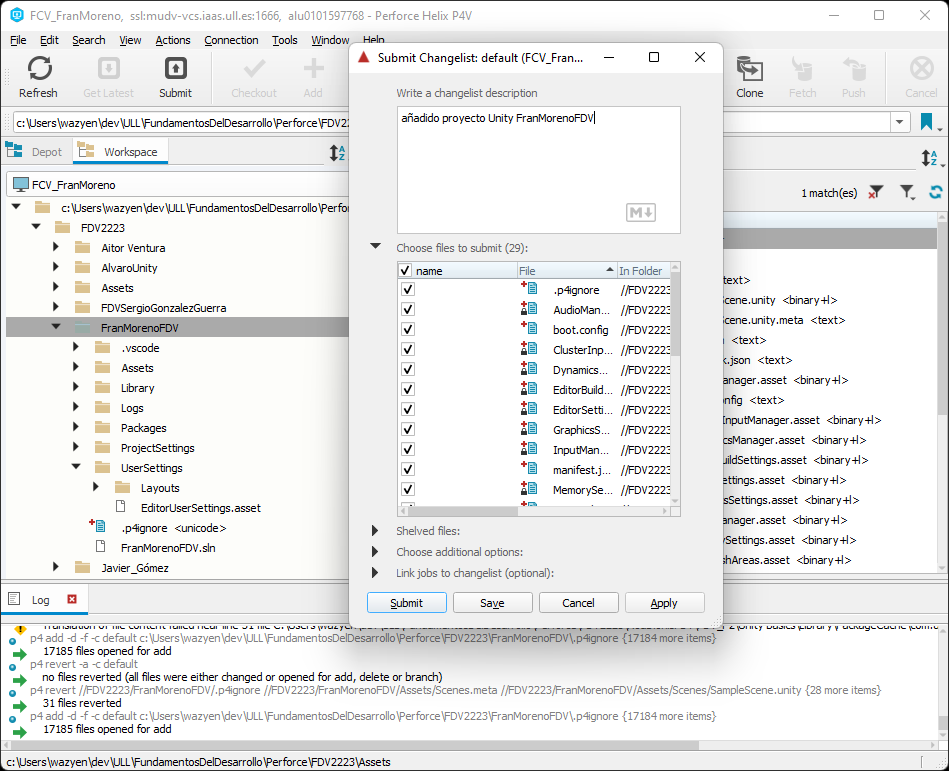