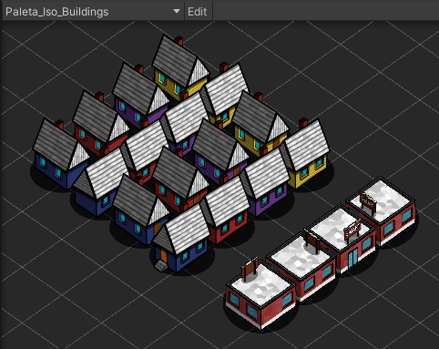
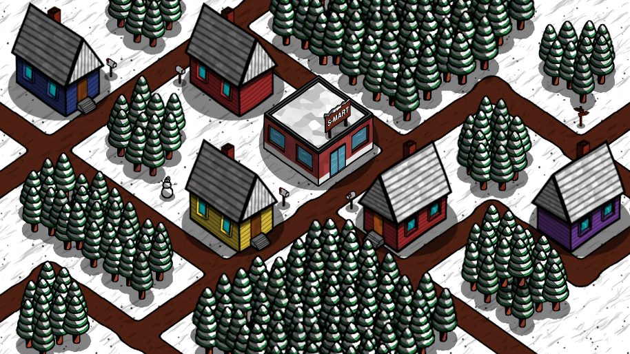
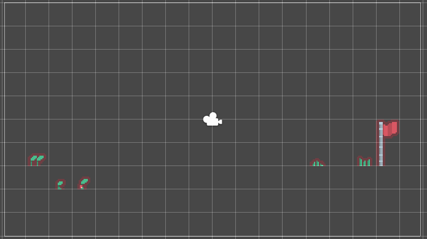

# Actividad 7

La actividad de esta semana consiste en la realización de pruebas con las herramientas de Unity para la generación de mapas de tiles. Los ejercicios a resolver son los siguientes:
1. Obtener assets que incorpores a tu proyecto para la generación del mapa: planos e isométricos.

Assets escogidos para el mapa rectangular: https://assetstore.unity.com/packages/2d/environments/free-pixel-art-kit-211149

Assets escogidos para el mapa isométrico: https://assetstore.unity.com/packages/2d/environments/cute-isometric-town-starter-pack-134286#content

(Ambos paquetes fueron proporcionados por la profesora)

2. Generar al menos 2 paletas para crear un mapa rectangular.

Para generar una paleta, hay que abrir un `Window -> 2D -> Tile Palette` y desde ahí pulsar el nombre de la paleta activa (como uno de los paquetes que importé incluía ya una paleta hecha me salía esa) y luego en `Create New Palette` y escoger la ruta donde queremos guardarla. Tras seguir los pasos anteriores, solo hay que arrastrar un atlas o un conjunto de sprites a la paleta activa para incluirlos. Para las paletas isométricas tuve que hacer muchos ajustes en los tamaños de las celdas para que los sprites isométricos me encajasen en la cuadrícula y hubiese una continuidad visual al poner varios contiguos. Siguiendo este procedimiento, finalmente creé 3 paletas para los sprites rectos y 2 para los isométricos:

3. Crear un mapa isométrico.
4. En el mapa isométrico generar zonas elevadas y obstáculos.

Estos son los dos tilemaps creados para el mapa isométrico:

- Suelo

- Edificios

Tras realizar todos los ajustes previamente descritos y montar el mapa isométrico, este es el resultado:

Mientras que tanto el suelo como los edificios forman parte de tilemaps, todos los árboles, buzones, un muñeco de nieve y una señal de cruce de caminos que hay son todo sprites añadidos a pelo a la escena. Como curiosidad, los tilemaps de edificios y de suelos hubo que meterlos en Grids diferentes con parámetros diferentes para poder cuadrarlos visualmente.

5. En el mapa convencional, incluir obstáculos y paredes.

Con el mapa rectangular no hubo que hacer tantos ajustes de celdas ni poner tilemaps en Grids diferentes. Finalmente acabamos con 4 tilemaps diferentes:

- Background: Incluye el cielo.

- Background 2: Incluye el sol. Es background, pero debe verse por encima del otro background, así que hubo que crear este separado del otro.

- Ground: Incluye todo lo que es suelo. Este tilemap tiene colisiones.

- Items: Todas las parafernalias que deba incluir nuestro mapa que no encajen con ninguno de los tilemaps anteriores, como hierba o cualquier otro objeto que no deba entrar en acción en nuestro juego.

6. Seleccionar sprites para usar como decoración y sprites animados para usar como personaje y como enemigos e incorporarlos al juego.

Se usaron luces de navidad (referenciadas al final de este documento) como sprite decorativo para esta escena. Como ya trabajamos en las animaciones del jugador y del enemigo en la actividad anterior (Actividad 6), solo rescatamos esa parte de la actividad y la incorporamos en la escena.

7. Controlar mediante scripts al menos dos transiciones de animación en el personaje y una de un enemigo

Nuevamente, como ya trabajamos en las animaciones del jugador y del enemigo en la actividad anterior (Actividad 6), solo rescatamos esa parte de la actividad y la incorporamos en la escena. Como el jugador tiene animaciones para caminar y para idle, como en esta ocasión ya nos vale con que el enemigo esté idle y mientras no lo hagamos caminar se quedará siempre idle, a ambos les pondremos el AnimatorController del player de la otra actividad.

Tras realizar todo lo anteriormente descrito, este es el resultado:

# Referencias

Sprite luces navideñas retocado con GIMP a partir de: https://www.shutterstock.com/image-vector/christmas-lights-pixel-art-isolated-on-2035497461