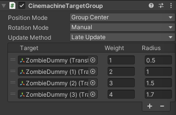
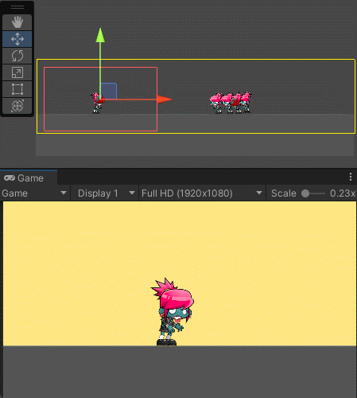
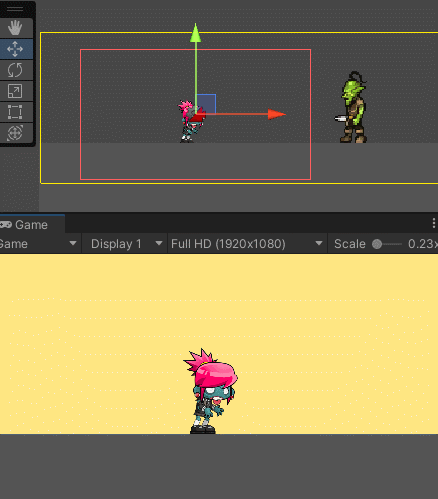
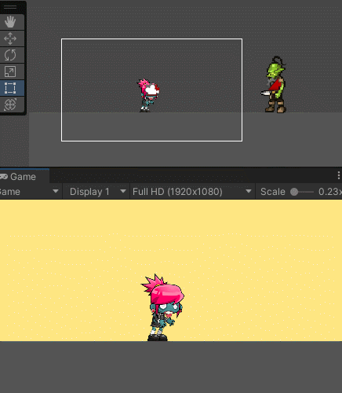

# Actividad 8

El objetivo de esta actividad es desarrollar una escena 2D en la que se incluyan varios personajes, uno de ellos debe considerarse el jugador, que se controlan desde el teclado. Se deben contemplar los siguientes requisitos.

a) Cámara (A) con seguimiento al jugador. Se debe configurar el seguimiento hacia adelante. Esta cámara es la que debe tener la máxima prioridad.

Crearemos una escena con un personaje zombie que heredaremos de otras actividades. Después, añadiremos un `GameObject -> Cinemachine -> 2D Camera`. En el atributo Follow referenciaremos al jugador, en `Body -> Tracked Obect Offset` daremos un valor positivo a la X, para que la cámara siempre esté enfocada hacia adelante con respecto al personaje. Por defecto, el atributo Priority es 10. Podemos subir ese valor o asegurarnos luego de que ninguna cámara lo supere. Así, esta será siempre la cámara con máxima prioridad.

b) Cámara (B) con seguimiento a un grupo de personajes que no sean el jugador. La zona donde no se activa el seguimiento debe ser mayor que la del personaje.

Crearemos varias copias del jugador a las que desactivaremos los componentes PlayerController y BoxCollider2D ya que por ahora no serán necesarios. Ahora añadiremos un `GameObject -> Cinemachine -> Target Group Camera` y se nos creará un TargetGroup y una cámara  como la de antes que tendrá configurado el TargetGroup como Follow y como LookAt. En el componente CinemachineTargetGroup del TargetGroup, deberemos referenciar a los zombies "dummy" que acabamos de crear.

Si jugamos un poco con esta cámara veremos que, cuando movamos uno de sus objetivos, la posición de la cámara se ajustará en todo momento para mantener a todos los objetivos en pantalla teniendo en cuenta los pesos y los radios que hayamos configurado para cada uno de ellos en el CinemachineTargetGroup. Esta es la configuración que hemos utilizado para este ejemplo:



Y este es el resultado:


c) Crear una zona de confinamiento para la cámara A que abarque toda la escena.

Los pasos a seguir para este ejercicio son:

1. Crear un GameObject vacío y añadirle un componente de tipo CompositeCollider2D con un GeometryType de Polygons.
2. El componente RigidBody2D que se le ha añadido automáticamente deberá ser de tipo Static.
3. Deberemos añadirle un componente BoxCollider2D que defina los límites de la escena y configurarlo para que tenga el parámetro UsedByComposite a true.
4. En el componente CinemachineVirtualCamera del jugador, en el apartado Extensions seleccionaremos la opción de añadir extensión y escogeremos la llamada CinemachineConfiner. Eso añadirá un componente con el mismo nombre a nuestra cámara.
5. En este nuevo componente, en el parámetro BoundingShape2D referenciaremos el GameObject con el CompositeCollider2D que acabamos de crear.
6. Es de suma importancia también crear una segunda capa (tal y como explicamos en la Actividad 7, Ejercicio 8, quinto apartado) a la que, en nuestro caso, llamaremos CameraBounds y cuyas colisiones con los objetos de la capa Default desactivaremos. En esta capa incluiremos tanto el CompositeCollider2D como las cámaras que haya en la escena. De este modo, nuestro personaje no colisionará con la colisión que simplemente queremos que defina los límites de la cámara.

Realizados los pasos previamente descritos, si jugamos con la escena, veremos este resultado con un Daming de 0.2 en el componente CinemachineConfiner de la cámara virtual del jugador:



d) Se debe crear una zona de confinamiento de la cámara B que abarque una parte de la escena.

Si seguimos los mismos pasos que acabamos de seguir con unos CameraBounds más limitados y se los asignamos a la cámara B, veremos que obtendremos unos resultados similares a los del segundo ejercicio, pero esta vez, cuando la cámara alcance los límites, esta dejará de actualizar su posición y lo que hará simplemente será hacerse más grande para intentar abarcar al zombie que se le escapa de la escena. Este es el resultado:


e) Añadir un objeto que genere una vibración en la cámara cuando A choca con él.

Para este ejercicio crearemos un GameObject de Goblin arrastrando uno de sus sprites a escena. Le añadiremos un componente Chinemachine Collision Impulse Source y un BoxCollider2D con el que deberá colisionar nuestra zombie. Además de esto, deberemos añadir una extensión de tipo Cinemachine Impulse Listener a la cámara de nuestra zombie. Deberemos asegurarnos de que tanto el componente Impulse Source como el Impulse Listener tengan el mismo valor en sus parámetros Impulse Channel y CHannel Mask, respectivamente. Hecho esto, nuestra cámara vibrará en cuanto nuestra zombie colisione con el ogro. Este es el resultado:



f) Agregar una tercera cámara (C) que siga a un personaje que no sea el jugador (sólo uno).

Ahora añadiremos una nueva cámara 2D que siga al ogro de manera similar a como la creamos para la zombie, en `GameObject -> Cinemachine -> 2D Camera` y referenciando al ogro desde el atributo Follow de la cámara virtual.

g) Seleccionar un conjunto de teclas que permitan hacer el cambio entre las cámaras A y C . (Habilitar/Deshabilitar el gameobject de la cámara virtual)

Para este ejercicio, dentro del script PlayerController que posee nuestra zombie, añadiremos un atributo público para la cámara virtual, que deberemos referenciar desde el editor. Con ese parámetro, en el método Update() del mismo script comprobaremos que haya alguna cámara referenciada y que se haya pulsado la tecla Q. Si ambas condiciones se cumplen, habilitaremos o deshabilitaremos dicha cámara:

```
public class PlayerController : MonoBehaviour
{
    [...]
    public CinemachineVirtualCamera _cmVirtualCamera;
    
    [...]

    void Update()
    {
        [...]
        
        // Manage camera change
        if (_cmVirtualCamera && Input.GetKeyDown(KeyCode.Q))
        {
            _cmVirtualCamera.enabled = !_cmVirtualCamera.enabled;
        }
    }
    
    [...]
}
```

Cada vez que pulsemos la tecla Q para cambiar de cámara, veremos cómo se realiza una transición suave entre la cámara recientemente deshabilitada y la cámara del ogro, que pasa a ser la cámara con mayor prioridad de las que quedan activas. Este es el resultado:



h) Extra: Generar una vibración en la cámara cada vez que se pulse la tecla de disparo. Agregar un perfil de ruido a la cámara, y modificar las propiedades de amplitud y frecuencia al component Noise

Para la realización de este ejercicio hemos seguido la siguiente serie de pasos:

1. Hemos cambiado el atributo Noise de la cámara virtual de nuestra zombie de none a BasicMultiChannelPerlin.
2. Dentro de ese mismo desplegable, hemos establecido una ganancia de amplitud de 0.1 y una ganancia de frecuencia de 10. Esto se debe a que queremos que nuestra vibración tenga una amplitud muy acotada pero a la vez que sea un movimiento muy violento, es decir, muy rápido.
3. Aquí viene la parte complicada del ejercicio. El atributo clave es NoiseProfile. Cuando este tenga un valor válido, la vibración se producirá; mientras no tenga ningún valor, no se producirá ninguna vibración. Este es el parámetro que debremos controlar desde script. Pero no es tan sencillo, puesto que este atributo requiere que le pasemos un asset como valor. Para ello, deberemos añadir un parámetro público NoiseSettings en nuestro script de PlayerController y meternos en el paquete de Cinemachine desde el explorador del proyecto para buscar los assets de NoiseSettings que tiene el paquete predefinidos, que son los mismos que se nos mostrarán si abrimos el desplegable de NoiseSettings desde el editor. En nuestro caso, decidimos usar el Handheld_normal_extreme. Este es el que referenciamos al PlayerController.
4. Una vez tenemos todo listo, simplemente desde el script de PlayerController deberemos obtener el valor del componente BasicMultiChannelPerlin de la cámara virtual en el Start y comprobar en Update que la tecla correspondiente, en nuestro caso la E, esté siendo pulsada y, en caso afirmativo, asignar al componente CinemachineBasicMultiChannelPerlin el NoiseSettings que hayamos escogido. En caso de que la tecla no esté siendo pulsada, asignaremos el valor null.

Este es el código resultante:

```

public class PlayerController : MonoBehaviour
{
    [...]
    
    public CinemachineVirtualCamera _cmVirtualCamera;
    public CinemachineBasicMultiChannelPerlin _cmPerlin;
    public NoiseSettings _cmNoiseProfile;
    
    void Start()
    {
        [...]
        if (_cmVirtualCamera)
        {
            _cmPerlin = _cmVirtualCamera.GetCinemachineComponent<CinemachineBasicMultiChannelPerlin>();
        }
    }

    void Update()
    {
        // Manage camera shake
        if (_cmPerlin)
        {
            if (Input.GetKey(KeyCode.E))
            {
                _cmPerlin.m_NoiseProfile = _cmNoiseProfile;
            }
            else
            {
                _cmPerlin.m_NoiseProfile = null;
            }
        }
    }
    
    [...]
}
```

Y este es el resultado:

